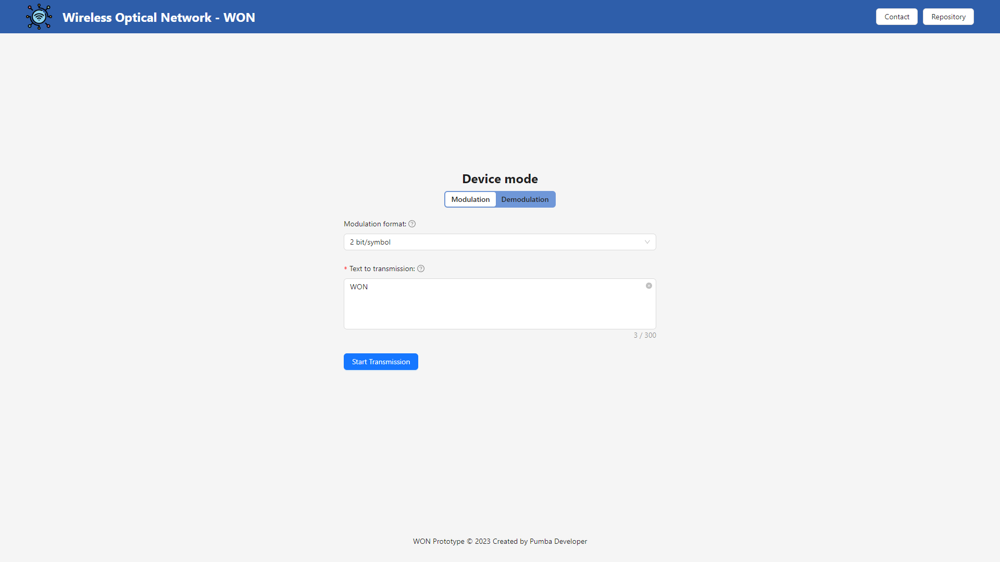

# 🚀 [ENLACE ÓPTICO SEM FIO](wireless-optical-network-prototype.vercel.app)




> Projeto desenvolvido para a prototipagem de um enlace óptico sem fio, utilizando um monitor como transmissor e uma câmera como receptor. O objetivo deste trabalho é experimentar os desafios encontrados na camada física durante a transmissão de dados e identificar quais técnicas podem ser utilizadas para mitigar seus efeitos. Mais informações podem ser encontradas no relatório [Protótipo de Rede WON](./src/assets/Protótipo%20de%20Rede%20WON.pdf).

<br />

## 📖 Feito Com:


## 💻 Pré-requisitos

Antes de começar, verifique se você atendeu aos seguintes requisitos:

- [`< Git >`](https://git-scm.com/)
- [`< NodeJS 18+ >`](https://nodejs.org/)

## 📥 Baixando o Projeto

Para clonar e baixar as dependências do projeto, utilize os comandos:

```
git clone https://github.com/pumba-dev/wireless-optical-network-prototype.git

cd wireless-optical-network-prototype

npm install
```

## 🚀 Iniciando Servidor Web

Para iniciar a aplicação, utilize o comando:

```
npm run dev
```

## 📫 Contribuindo com o Projeto

Para contribuir com website, siga estas etapas:

1. Bifurque este repositório.
2. Crie um branch: `git checkout -b <nome_branch>`.
3. Faça suas alterações e confirme-as: `git commit -m '<mensagem_commit>'`
4. Envie para o branch original: `git push origin <wireless-optical-network-prototype> / <local>`
5. Crie a solicitação de pull.

Como alternativa, consulte a documentação do GitHub em [como criar uma solicitação pull](https://help.github.com/en/github/collaborating-with-issues-and-pull-requests/creating-a-pull-request).

## 🤝 Colaboradores

Agradecemos às seguintes pessoas que contribuíram para este projeto:

<table>
  <tr>
    <td align="center">
      <a href="https://github.com/pumba-dev">
        <br>
        <sub>
          <b>Eu Mesmo</b>
        </sub>
      </a>
    </td>
  </tr>
</table>

## 😄 Seja um dos Contribuidores<br>

Entre em contato para se tornar um contribuidor.

## 💰 Donate

[](https://picpay.me/pumbadev)
[](https://nubank.com.br/pagar/1ou9f/ifu2K7YNO7)

## 📝 Licença

Copyright © 2024 Pumba Developer

[⬆ Voltar ao topo](#wireless-optical-network-prototype)<br>
